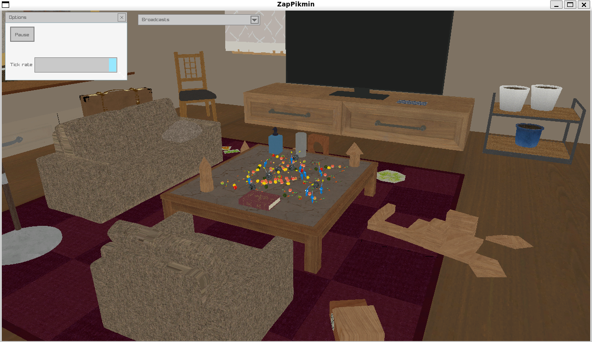
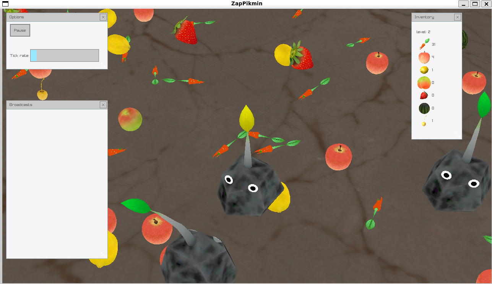

# Zappy
- **Contributors:**
  - [Léo Wehrle - Rentmeister](https://github.com/leoWherle)
  - [Théodore Magna](https://github.com/TheodoreEpitech)
  - [Raphaël Castres](https://github.com/castres-raphael)
  - [Lucien Pineau](https://github.com/mathematisse)
  - [Martin Sabatier](https://github.com/Nevi1)
  - [Nathanael Kimbembe-Croissant](https://github.com/Nathanael-Kimbembe)

## Description
The goal of this project is to create a network game where several teams confront on a tiles map
containing resources.
The winning team is the first one where at least 6 players who reach the maximum elevation.


## Install & Build

#### Ubuntu
```sh
sudo apt install libasound2-dev libx11-dev libxrandr-dev libxi-dev libgl1-mesa-dev libglu1-mesa-dev libxcursor-dev libxinerama-dev libwayland-dev libxkbcommon-dev
```
#### Arch
```sh
sudo pacman -S alsa-lib mesa libx11 libxrandr libxi libxcursor libxinerama
```
#### Fedora
```sh
sudo dnf install alsa-lib-devel mesa-libGL-devel libX11-devel libXrandr-devel libXi-devel libXcursor-devel libXinerama-devel libatomic
```

```sh
make install
```

### Build binaries
```sh
make
ls
> zappy_server zappy_ai zappy_gui
```

## Documentation
- [AI Protocol](./doc/AI-protocol.md)
- [GUI Protocol](./doc/Gui-protocol.md)

## Usage
```bash
./zappy_server -help
USAGE: ./zappy_server -p port -x width -y height -n name1 name2 ... -c clientsNb -f freq
  option description
  -p port port number
  -x width width of the world
  -y height height of the world
  -n name1 name2 .. . name of the team
  -c clientsNb number of authorized clients per team
  -f freq reciprocal of time unit for execution of actions

```
  ```bash
./zappy_gui -help
USAGE: ./zappy_gui -p port -h machine
  option description
  -p port port number
  -h machine name of the machine
```
```bash
./zappy_ai -help
USAGE: ./zappy_ai -p port -n name -h machine
  option description
  -p port port number
  -n name name of the team
  -h machine name of the machine; localhost by default
```
```bash
make launch
```

## BONUSES

- .env file support

## Screenshots

